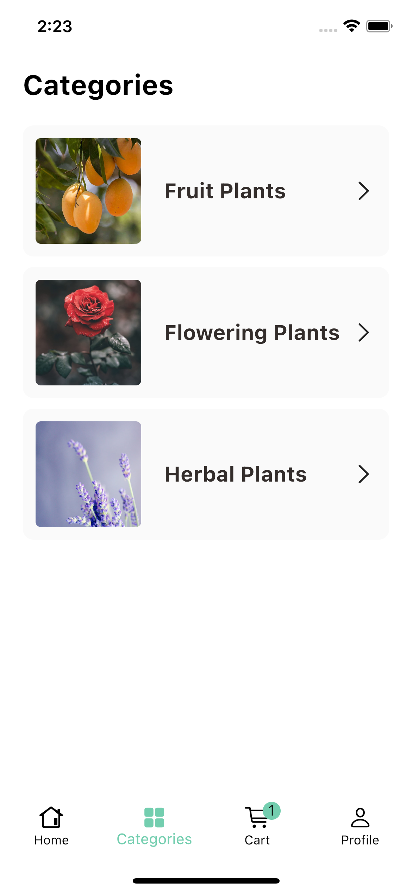
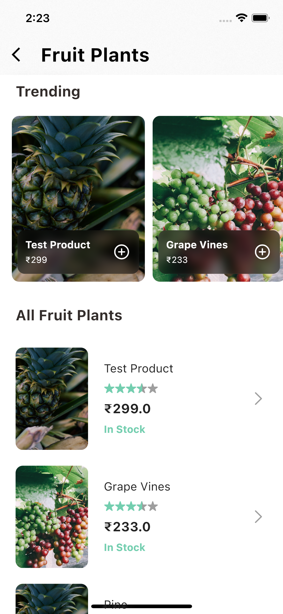
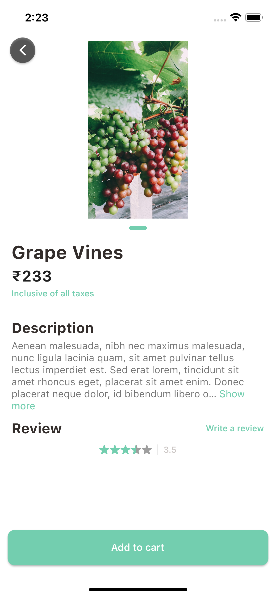
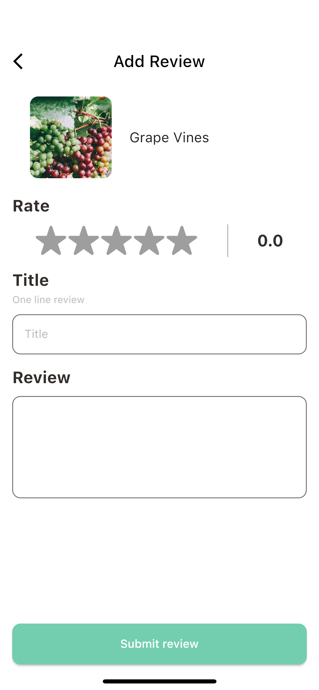
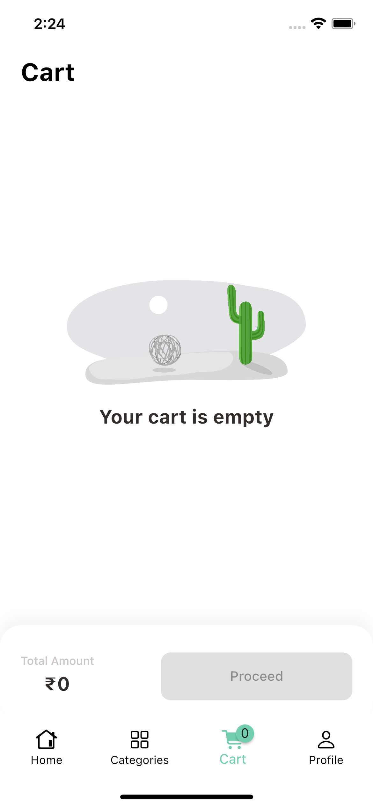
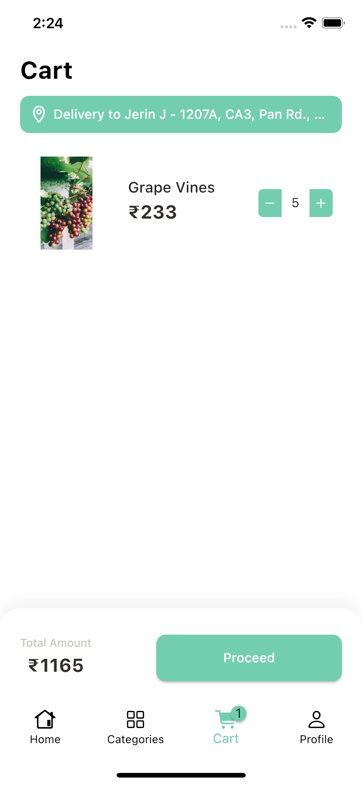
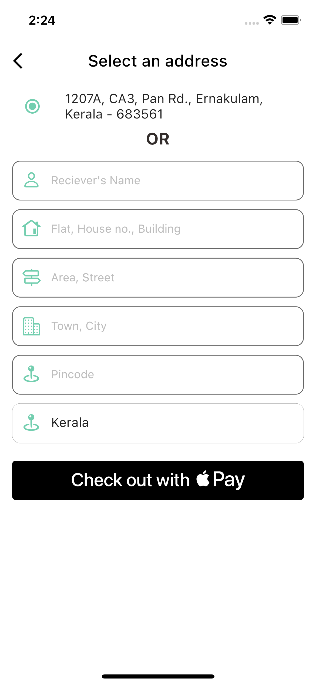
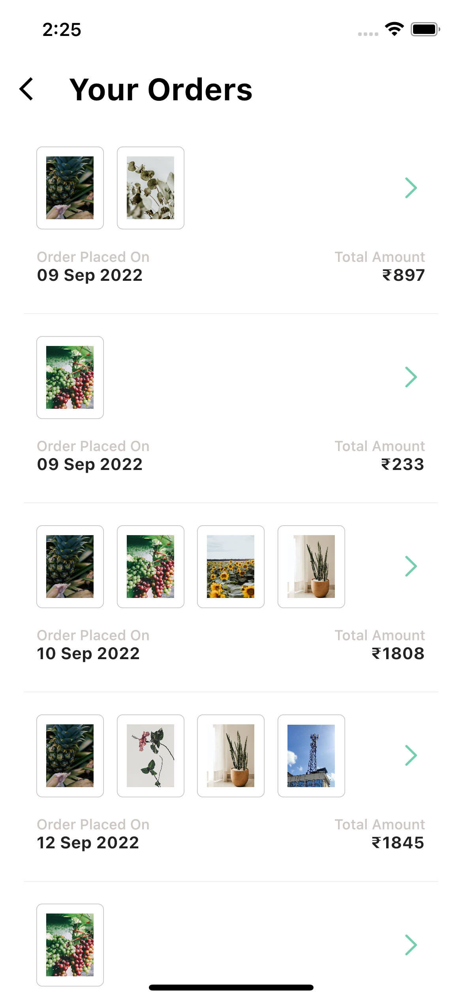
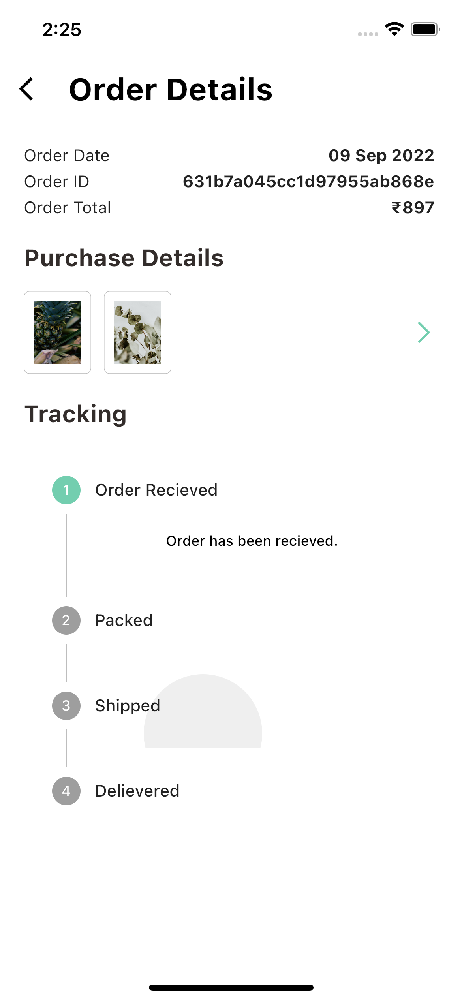

# jgarden

An ecommerce mobile application built using Flutter.

### Screenshots

<table>
  <tr>
    <td align="center">Signup</td>
    <td align="center">Login</td>
    <td align="center">Categories</td>
    <td align="center">Detailed Categories</td>
  </tr>
  <tr>
    <td align="center"></td>
    <td align="center"></td>
    <td align="center"></td>
    <td align="center"></td>
    
  </tr>
</table>

<table>
  <tr>
    <td align="center">Product Details</td>
    <td align="center">Review</td>
    <td align="center">Empty Cart</td>
    <td align="center">Cart</td>
  </tr>
  <tr>
    <td align="center"></td>
    <td align="center"></td>
    <td align="center"></td>
    <td align="center"></td>
    
  </tr>
</table>

<table>
  <tr>
    <td align="center">Checkout</td>
    <td align="center">Past Orders</td>
    <td align="center">Order Details</td>
    <td align="center">Purchase Details</td>
  </tr>
  <tr>
    <td align="center"></td>
    <td align="center"></td>
    <td align="center"></td>
    <td align="center"></td>
    
  </tr>
</table>
